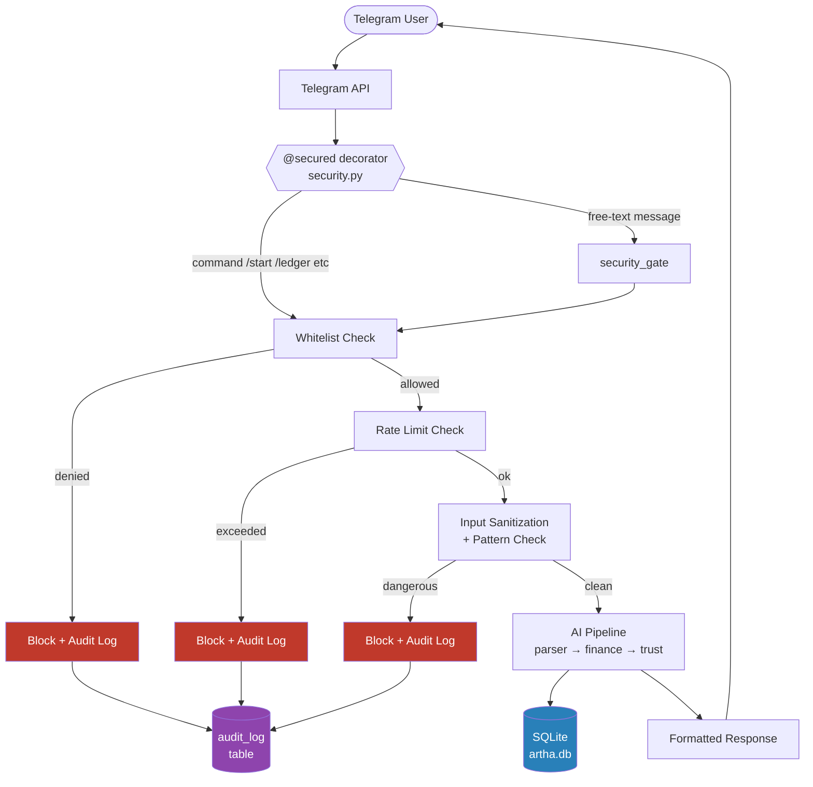
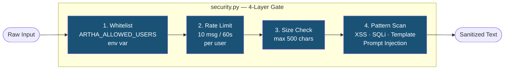
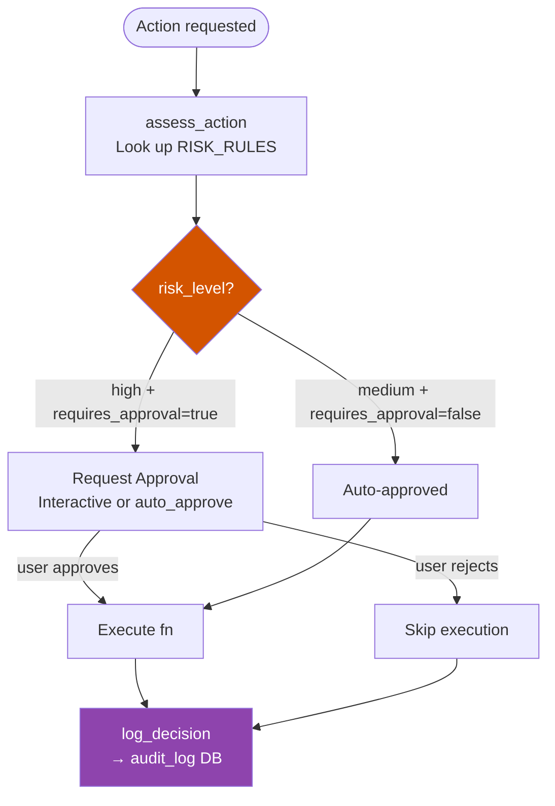
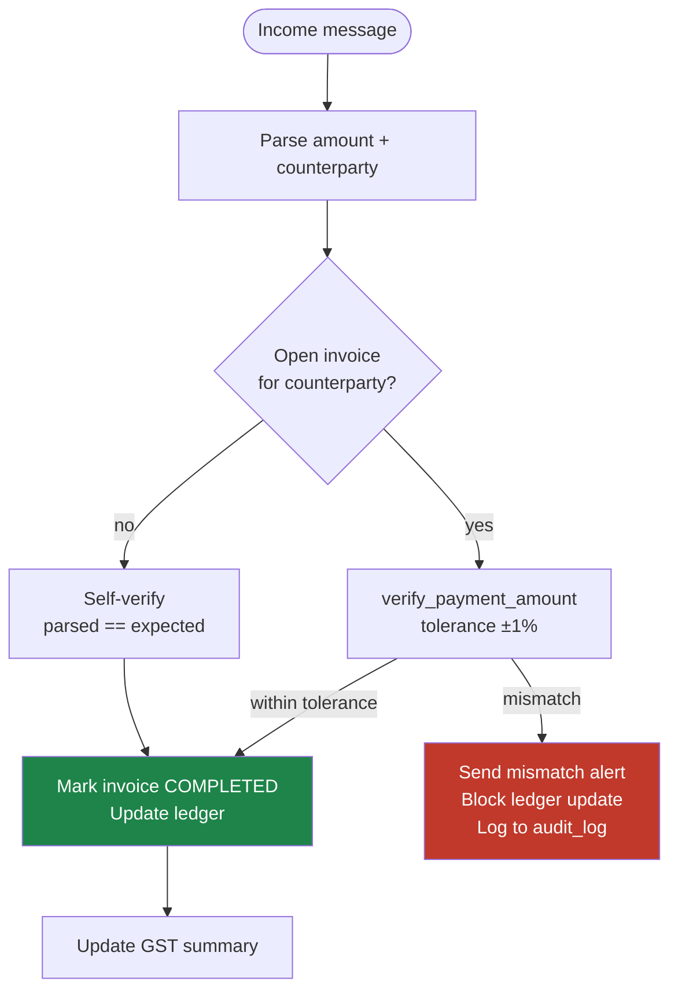
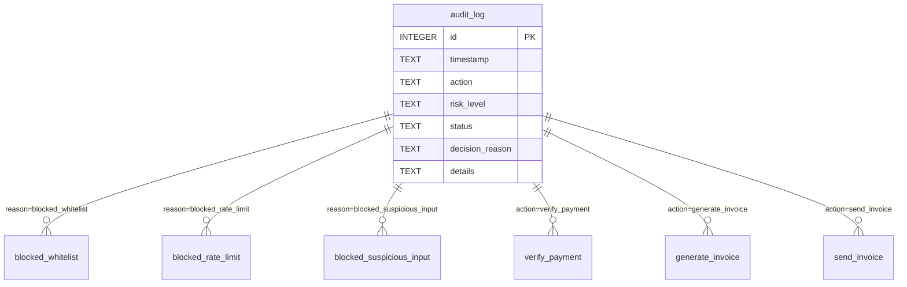
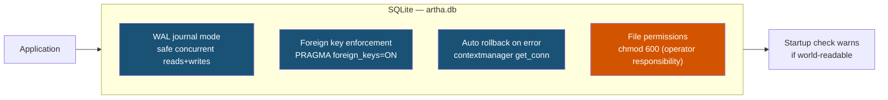
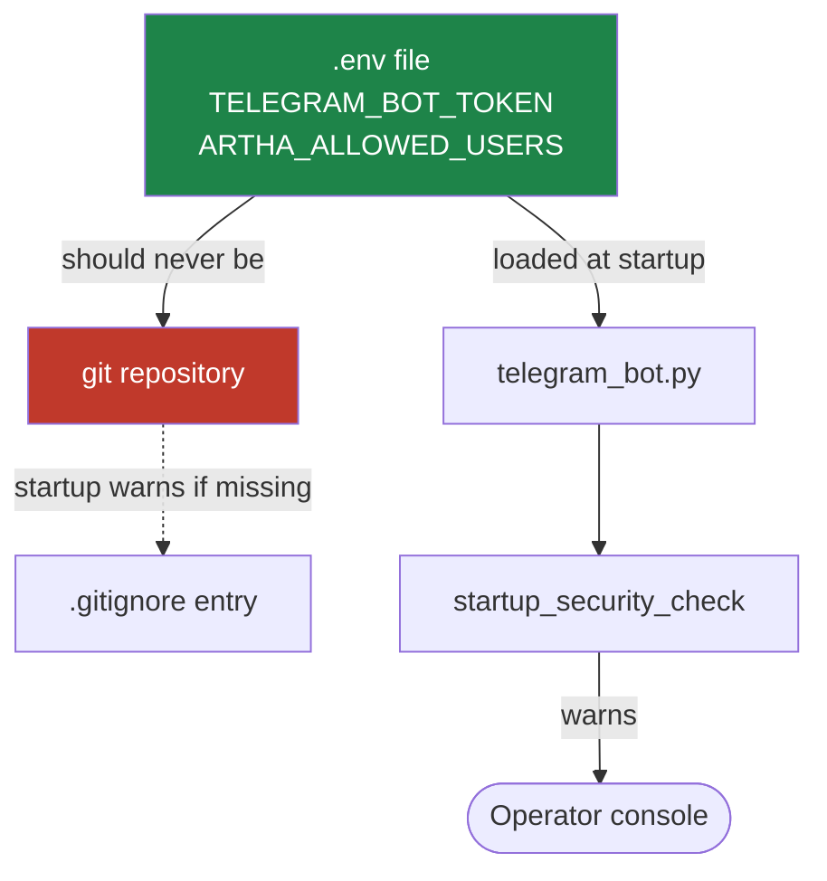
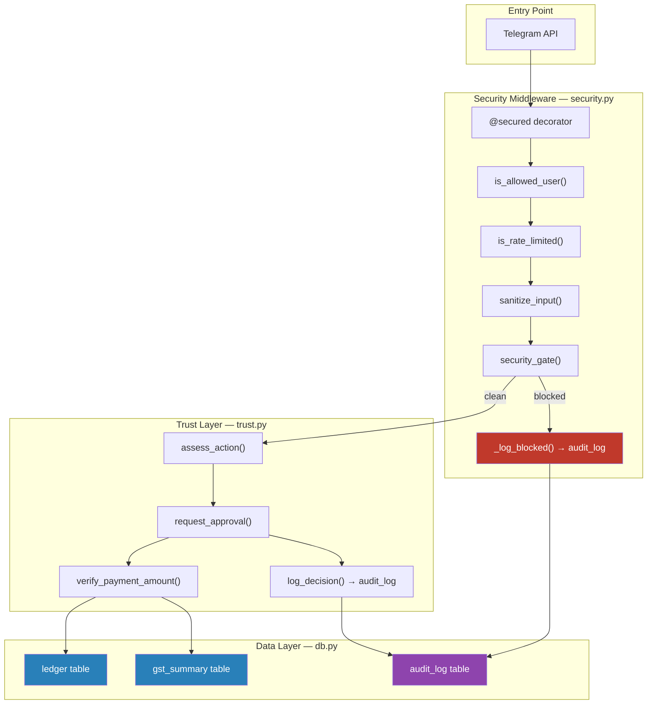

# Artha FinOps — Security Architecture

Artha uses a layered, custom-built security model with no external security dependencies. Every message from Telegram passes through multiple gates before reaching the AI pipeline or database.

---

## 1. Overall Request Flow

---

## 2. Security Middleware Layers

### Blocked patterns (`security.py:106-121`)

| Category | Patterns detected |
|---|---|
| XSS | `<script`, `javascript:` |
| SQL injection | `--`, `; DROP`, `; DELETE`, `; INSERT`, `; UPDATE` |
| Template injection | `${`, `{{` |
| Prompt injection | `ignore previous`, `ignore all`, `system prompt`, `you are now`, `forget everything` |

---

## 3. Trust & Action Verification Layer

High-risk financial actions require explicit verification before execution. This is handled by `trust.py`.

### Risk classification (`trust.py:13-49`)

| Action | Risk Level | Requires Approval |
|---|---|---|
| `verify_payment` | high | yes |
| `generate_invoice` | high | yes |
| `send_invoice` | high | yes |
| `modify_ledger_entry` | high | yes |
| `external_api_call` | high | yes |
| `update_ledger` | medium | no |
| `update_gst_summary` | medium | no |
| unknown action | medium | yes (fail-safe) |

---

## 4. Payment Verification Flow

Income events are verified against open invoices before the ledger is updated.

---

## 5. Audit Log

Every blocked request and every sensitive action decision is written to the `audit_log` table in SQLite. Raw malicious content is never stored — only a SHA-256 hash prefix.

Blocked attempts store:
- `user_id` + `username`
- `input_hash` — first 16 hex chars of `SHA-256(raw_input)` — never the raw content
- `input_length`
- block `reason`

---

## 6. Database Security

Startup checks (`security.py:285-329`) warn the operator if:
- `ARTHA_ALLOWED_USERS` is not set (deny-all default)
- `.env` exists but is not in `.gitignore`
- `artha.db` has world-readable permissions

---

## 7. Secrets & Config

All tuneable security parameters are environment variables:

| Variable | Default | Purpose |
|---|---|---|
| `ARTHA_ALLOWED_USERS` | (none — deny all) | Comma-separated allowed Telegram user IDs |
| `ARTHA_RATE_LIMIT_MAX` | `10` | Max messages per window |
| `ARTHA_RATE_LIMIT_WINDOW` | `60` | Window size in seconds |
| `ARTHA_MAX_INPUT_LENGTH` | `500` | Max input characters |
| `TELEGRAM_BOT_TOKEN` | (required) | Bot authentication token |

---

## 8. Security Component Map

